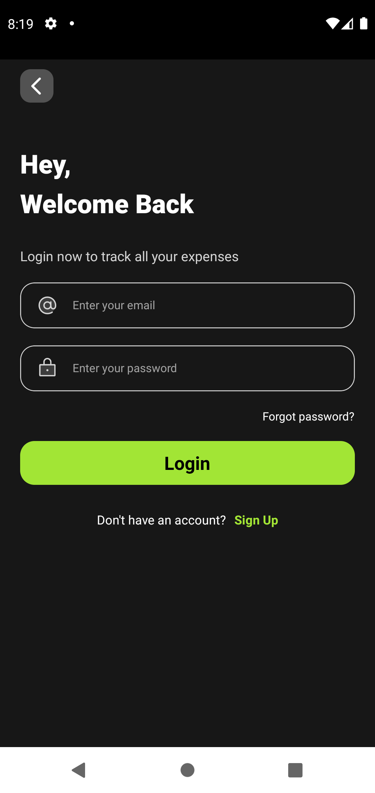
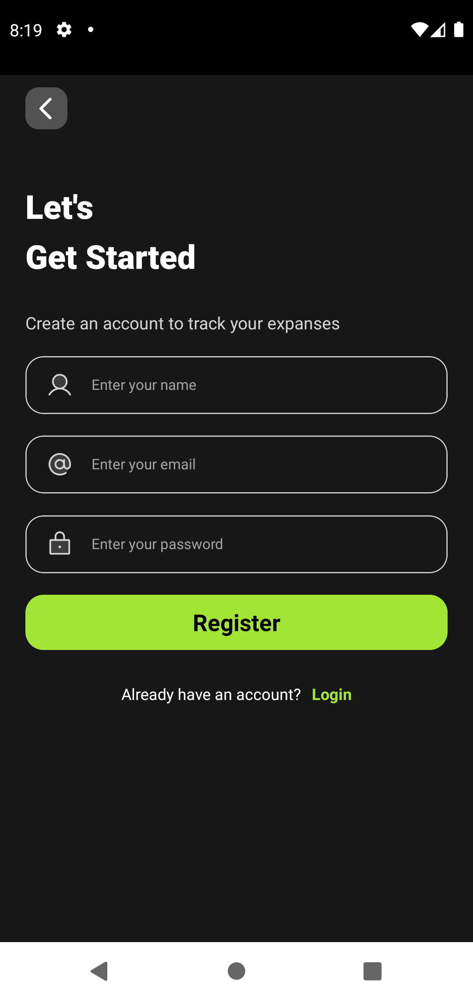

# Money Wise

Money Wise é um aplicativo desenvolvido com **Expo** e **React Native** para ajudar no controle financeiro pessoal.  
Com ele, você pode registrar despesas, receitas, categorizar transações e visualizar relatórios para acompanhar melhor sua vida financeira.

---

## 🚀 Novidades

- **Autenticação:** Funções de autenticação utilizando **Firebase Auth** e **Firestore** para cadastro e login de usuários.
- **Telas prontas:** Telas de boas-vindas, login e cadastro já implementadas.

---

## 📱 Telas do Aplicativo

### Tela de Boas-vindas
Ao abrir o Money Wise, você é recebido por uma tela de boas-vindas que apresenta o aplicativo e oferece opções para acessar ou criar uma conta.

<div align="center">
  
</div>

---

### Tela de Login
Permite que usuários já cadastrados entrem em suas contas de forma segura, utilizando autenticação via Firebase.

<div align="center">
  
</div>

---

### Tela de Cadastro
Possibilita que novos usuários criem uma conta rapidamente, armazenando dados de autenticação no Firebase Auth e informações adicionais no Firestore.

<div align="center">
  
</div>

---

## 💡 Sobre o Projeto

O objetivo do Money Wise é proporcionar uma experiência **simples** e **intuitiva** para que qualquer pessoa consiga:

- Organizar suas finanças
- Entender para onde o dinheiro está indo
- Tomar decisões mais conscientes sobre gastos

Conforme o desenvolvimento do app avança, este README será atualizado com novas funcionalidades, instruções de uso e dicas.

---

## ⚙️ Como Começar

1. Instale as dependências:
   ```bash
   npm install
